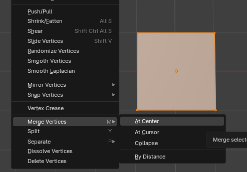

# Unity
## Install
Unity Hub
Add project from disk
select project

## Magnet
Der Magnet ist eine Pipe und wurde mit dem Unity *ProBuilder*-Asset erstellt. 

ProBuilder importieren: 
1. Window
2. Package Manager
3. Unity Registry
4. Probuilder

ProBuilder verwenden
1. Tools
2. ProBuilder
3. ProBuilder Window

Auf jede Pipe wurde das Skript *Magnets* gezogen. Darin wird die Tastenbelegung zum aktivieren/deaktivieren der Magnete festgelegt.

## Strecke
Die Strecke wurde als FBX-Datei aus Blender in Unity importiert. (Drag'n'drop) Dann muss noch ein Mesh Collider hinzugefügt werden, um Kollision mit der Murmel zu ermöglichen. Murmel kann von der Strecke abkommen -> Idee: für mehr Sicherheit evtl. eine nicht sichtbare geschlossene Bahn und eine offene Bahn ohne Mesh Collider.

# Code
Bei Aktivierung des Magneten wird der Murmel *Force* in richtung Magnet zugeführt. Die Magneten arbeiten mit dem Tag "Marble". Der Tag muss der Murmel hinzugefügt werden. 

# Blender
## Kurve erstellen
1. Add -> Mesh -> Plane

2. *Tab* -> rechtsclick -> Merge Vertices -> At Center

3. *E* (Extend) (ctrl + linksclick zum ausrichten am Mesh) -> Strecke modellieren (Kurven folgen im nächsten schritt)

4. *A* (Alles markieren) -> *Ctrl + Shift + B* -> Maus nach rechts bewegen fügt zwischenpunte für Rundung ein (Mausrad = menge der Punkte)

5. *A* -> *Tab* (EditMode -> ObjectMode)

6. Object -> Convert -> Curve

7. rechts auf Curve-Einstellungen

8. Geometry -> Depth

9. optional TwistMethod: Z-Up; FillMode: Half

10. Drehen: *A* -> *Tab* -> *A*/Einzelne Punkte Markieren -> *Ctrl + T* ->drehen

11. *A* -> Object/Convert/Mesh

12. Add Modifier -> Solidify -> edit Thickness

13. Export: File/Export/FBX